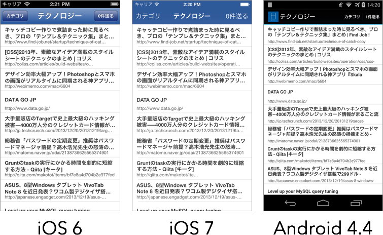

# HBCW

Hatena Bookmark's "Hot entry" send to My Chat in ChatWork.<br />
(ChatWork API and Appcelerator Titanium™ (Alloy Framework) combination concept application.)

## Caution

**This is UNOFFICIAL application. NO SUPPORT (Please read The MIT License).**

## Screen shot



## Usage

### 1. Get ChatWork API token

Please read [ChatWork developer portal](http://developer.chatwork.com/).

### 2. Edit config.json

Open `app/config.json` and edit `CHATWORK_API_TOKEN` line's value.

```json
{
    "global": {
        "CHATWORK_API_TOKEN": "INPUT YOUR CHATWORK API TOKEN",
```

### 3. Build

This application is use Titanium 3.2 Release Candidate and Alloy 1.3.0 Release Candidate.<br />
Please setup these version read at [Appcelerator Blog](http://www.appcelerator.com/blog/2013/12/3-2-0-rc-of-sdkstudio-now-available/).

## License

### This application

    The MIT License (MIT)

    Copyright (c) 2013 Ryutaro Miyashita

    Permission is hereby granted, free of charge, to any person obtaining a copy
    of this software and associated documentation files (the "Software"), to deal
    in the Software without restriction, including without limitation the rights
    to use, copy, modify, merge, publish, distribute, sublicense, and/or sell
    copies of the Software, and to permit persons to whom the Software is
    furnished to do so, subject to the following conditions:

    The above copyright notice and this permission notice shall be included in
    all copies or substantial portions of the Software.

    THE SOFTWARE IS PROVIDED "AS IS", WITHOUT WARRANTY OF ANY KIND, EXPRESS OR
    IMPLIED, INCLUDING BUT NOT LIMITED TO THE WARRANTIES OF MERCHANTABILITY,
    FITNESS FOR A PARTICULAR PURPOSE AND NONINFRINGEMENT. IN NO EVENT SHALL THE
    AUTHORS OR COPYRIGHT HOLDERS BE LIABLE FOR ANY CLAIM, DAMAGES OR OTHER
    LIABILITY, WHETHER IN AN ACTION OF CONTRACT, TORT OR OTHERWISE, ARISING FROM,
    OUT OF OR IN CONNECTION WITH THE SOFTWARE OR THE USE OR OTHER DEALINGS IN
    THE SOFTWARE.

### [Appcelerator Titanium](https://github.com/appcelerator/titanium_mobile)

    Stuff our legal folk make us say:

    Appcelerator, Appcelerator Titanium and associated marks and logos are
    trademarks of Appcelerator, Inc.

    Titanium is Copyright (c) 2008-2013 by Appcelerator, Inc. All Rights Reserved.

    Titanium is licensed under the Apache Public License (Version 2). Please
    see the LICENSE file for the full license.

### [simple-cw-titanium](https://github.com/astronaughts/simple-cw-titanium)

    The MIT License (MIT)

    Copyright (c) 2013 astronaughts

    Permission is hereby granted, free of charge, to any person obtaining a copy of
    this software and associated documentation files (the "Software"), to deal in
    the Software without restriction, including without limitation the rights to
    use, copy, modify, merge, publish, distribute, sublicense, and/or sell copies of
    the Software, and to permit persons to whom the Software is furnished to do so,
    subject to the following conditions:

    The above copyright notice and this permission notice shall be included in all
    copies or substantial portions of the Software.

    THE SOFTWARE IS PROVIDED "AS IS", WITHOUT WARRANTY OF ANY KIND, EXPRESS OR
    IMPLIED, INCLUDING BUT NOT LIMITED TO THE WARRANTIES OF MERCHANTABILITY, FITNESS
    FOR A PARTICULAR PURPOSE AND NONINFRINGEMENT. IN NO EVENT SHALL THE AUTHORS OR
    COPYRIGHT HOLDERS BE LIABLE FOR ANY CLAIM, DAMAGES OR OTHER LIABILITY, WHETHER
    IN AN ACTION OF CONTRACT, TORT OR OTHERWISE, ARISING FROM, OUT OF OR IN
    CONNECTION WITH THE SOFTWARE OR THE USE OR OTHER DEALINGS IN THE SOFTWARE.

### Other awesome libraries

* [lodash.js](http://lodash.com/license)
* [underscore.deferred](https://github.com/wookiehangover/underscore.deferred/blob/master/LICENSE-MIT)
